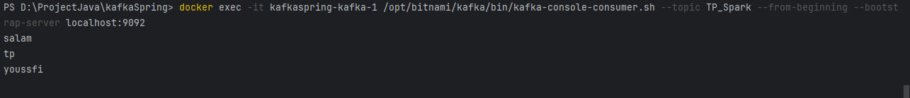
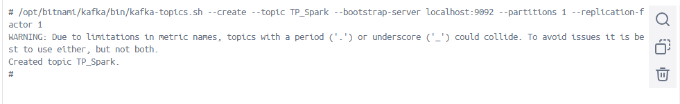
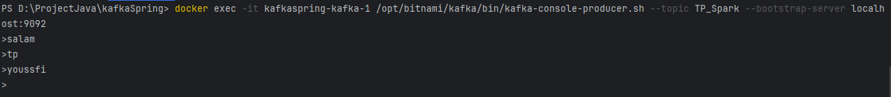
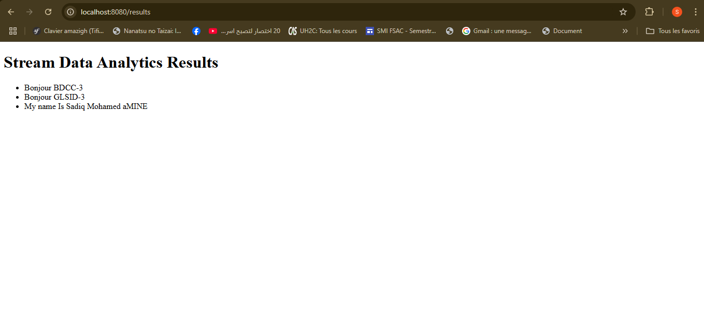
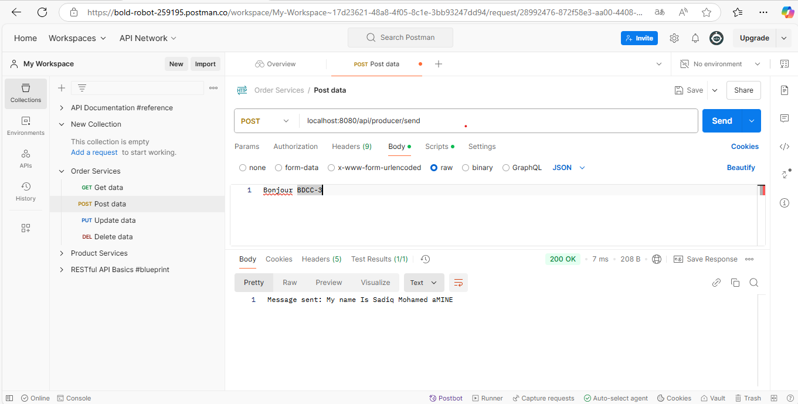
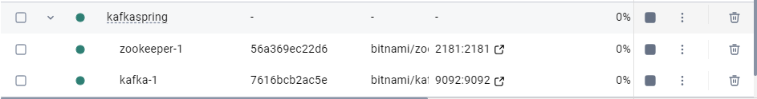

# Projet Kafka avec Docker et Spring Cloud Streams

## Objectifs

- Mettre en place une architecture Kafka en utilisant Docker
- Créer des services producteur, consommateur et fournisseur de données Kafka
- Implémenter un service de traitement de flux de données en temps réel avec Kafka Streams
- Créer une application web pour afficher les résultats du traitement en temps réel

## Configuration Docker

1. Créez le fichier `docker-compose.yml` suivant pour démarrer les conteneurs Zookeeper et Kafka :

```yaml
version: "3"
networks:
  myNetwork:

services:

  zookeeper:
    image: 'bitnami/zookeeper:latest'
    ports:
      - '2181:2181'
    environment:
      - ALLOW_ANONYMOUS_LOGIN=yes
    networks:
      - myNetwork

  kafka:
    image: 'bitnami/kafka:latest'
    user: root
    ports:
      - '9092:9092'
    environment:
      - KAFKA_BROKER_ID=1
      - KAFKA_LISTENERS=PLAINTEXT://:9092
      - KAFKA_ADVERTISED_LISTENERS=PLAINTEXT://127.0.0.1:9092
      - KAFKA_ZOOKEEPER_CONNECT=zookeeper:2181
      - ALLOW_PLAINTEXT_LISTENER=yes
    volumes:
      - ./Kafka:/bitnami/kafka
    networks:
      - myNetwork
    depends_on:
      - zookeeper
```

2. Démarrez les conteneurs Docker :

```bash
docker-compose up -d
```

3. Testez le fonctionnement de Kafka avec les commandes `kafka-console-producer` et `kafka-console-consumer`.

## Services Spring Cloud Streams

1. **Service Producer Kafka** : Utilisez l'image `consumer.png` pour créer un service REST qui produit des données dans un topic Kafka.

   

2. **Service Consumer Kafka** : Utilisez l'image `create_topic.png` pour créer un service qui consomme les données du topic Kafka.

   

3. **Service Supplier Kafka** : Utilisez l'image `producer.png` pour créer un service qui fournit des données à publier dans le topic Kafka.

   

4. **Service de Data Analytics Real Time Stream Processing** : Utilisez l'image `StreamDataRead.png` pour créer un service qui traite en temps réel les données du topic Kafka.

   

5. **Application Web** : Créez une application web qui affiche en temps réel les résultats du traitement de flux de données.

   

   

Assurez-vous d'utiliser les bibliothèques Spring Cloud Streams et Kafka Streams pour implémenter ces services.

## Fonctionnement global

1. Le service producteur publie des données dans un topic Kafka.
2. Le service consommateur récupère ces données du topic Kafka.
3. Le service fournisseur alimente le topic Kafka avec de nouvelles données.
4. Le service de traitement en temps réel consomme les données du topic Kafka et effectue des analyses en continu.
5. L'application web affiche les résultats du traitement en temps réel.

N'hésitez pas à me contacter si vous avez d'autres questions !
